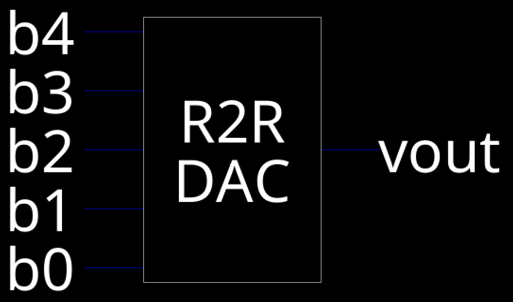

# Lab 1: 5-Bit R2R VLSI

Cade Thornton

10/16/2023

ENCE 3501

## Table of Contents

+ [Introduction](#Introduction )
+ [Voltage Divider](#VoltageDivider)
    * [Schematic](#Schematic)
    * [Layout](#Layout)
    * [Simulations](#Simulations)
+ [5-Bit R2R DAC](#5-BitR2RDAC)
    * [Hand Calc](#HandCal)
    * [Schematic](#Schematic)
    * [Layout](#Layout)
    * [Simulations](#Simulations)
+ [Conclusion](#Conclusion)

## Introduction 
<p align="center">
In this lab, a  virtual 5-bit R2R DAC Circuit is made using Electric VLSI. The design is verified using LTSpice, and consists of a voltage divider resistor IC combined in parallel with other copies of the ic to form the DAC. The layout was made in a similar manner. 
</p>

<p align="center">
  
</p>
<div align="center">
  <p style="font-size: small;">
    Figure 1 (Schematic of R2R Ladder System)
  </p>
</div>


## Voltage Divider

### Schematic

<p align="center"> 
The provided schematic features two resistors. The one linked to the input boasts a resistance that is twice that of the resistor linked to the ground. With a resistance value of 10kΩ for the resistor connected to ground, the one connected to the input exhibits a resistance of 20kΩ.
</p>

<p align="center">
  
</p>

<div align="center">
  <p style="font-size: small;">
    Figure 2 (Schematic of Given Voltage Divider)
  </p>
</div>

<p align="center"> 
An electric VLSI schematic was created from the above schematic, with two 10k ohm resistors replacing 2R
</p>

<p align="center">
  
</p>

<div align="center">
  <p style="font-size: small;">
    Figure 3 (ElectricVLSI Schematic of Voltage Divider)
  </p>
</div>

<p align="center"> 
The schematic generated an icon which was modified to be compact enough to be placed for the DAC
</p>

<p align="center">
  
</p>

<div align="center">
  <p style="font-size: small;">
    Figure 4 (ElectricVLSI Icon of Voltage Divider)
  </p>
</div>

</p>

### Layout 

<p align="center"> 
For the voltage Divider, the layout was made from three n-well resistors with a width of 15 &lambda; and a length of 175.44 &lambda; and the given value of R<sub>sq</sub> = 855 &Omega;/square. Using a width value, the appropriate length was calculated as follows:
</p>

```
10000 = (855)*(L/15)
L = (10000*15)/855
L = 175.44 
```
<p align="center">
Each node was connected to an appropriate input and output using metal contacts
</p>

<p align="center">
  
</p>

<div align="center">
  <p style="font-size: small;">
    Figure 5 (ElectricVLSI Layout of Voltage Divider)
  </p>
</div>

<p align="center">
And here is the 3D view of the layout
</p>

<p align="center">
  
</p>

<div align="center">
  <p style="font-size: small;">
    Figure 6 (ElectricVLSI 3D view of Layout of Voltage Divider)
  </p>
</div>


### Simulations 

------

<p align="center">
  The RDIV schematic was simulated by creating a separate cell group in which the RDIV icon was imported. 5V was passed through the circuit as input, and the expected simulation output was 1.667V.
</p>

<p align="center">
  
</p>

<div align="center">
  <p style="font-size: small;">
    Figure 7 (Voltage Divider Simulation)
  </p>
</div>

<p align="center">
  This is the SPICE Code used for the schematic simulation:
</p>

```
vdd vin 0 DC 5V
.op
```
<div align="center">
  <p style="font-size: small;">
    Figure 8 (Voltage Divider Simulation Spice Code)
  </p>
</div>

<p align="center"> 
  The results of the simulation are shown below, with an output voltage of 1.667V, indidcating that the schematic is correct.
</p>

<p align="center">
  
</p>

<div align="center">
  <p style="font-size: small;">
    Figure 9 (Voltage Divider Schematic Simulation Result)
  </p>
</div>

<p align="center"> 
  The layout was simulated in a similar manner, with an ideal output being 1.667V:
</p>

<p align="center">
  
</p>

<div align="center">
  <p style="font-size: small;">
    Figure 10 (Voltage Divider Layout Simulation)
  </p>
</div>

<p align="center"> 
  These are the results for the layout simulation, showing that a correct output of 1.667V was achieved:
</p>

<p align="center">
  
</p>

<div align="center">
  <p style="font-size: small;">
    Figure 11 (Voltage Divider Layout Simulation Results)
  </p>
</div>

<p align="center"> 
  The resulting NCC check also passed with no errors:
</p>

<p align="center">
  
</p>

<div align="center">
  <p style="font-size: small;">
    Figure 12 (Voltage Divider NCC check results)
  </p>
</div>


## 5-Bit R2R DAC

### Hand Calc

<p align="center"> 
  In order to find R<sub>eq</sub> for the 5-Bit DAC, all inputs are grounded and the resistance is measured between the output and ground:
</p>

<p align="center">
  
</p>

<div align="center">
  <p style="font-size: small;">
    Figure 13 (Hand Calculations of the R<sub>eq</sub> for the DAC)
  </p>
</div>

<p align="center"> 
  We use the equation &tau; = C*R<sub>EQ</sub> to calculate the delay caused by the 10pF load capacitor:
</p>


R<sub>EQ</sub> = 10k&Omega;

C<sub>EQ</sub>= 10pF

&tau; = 0.7 (10k&Omega;)(10pF)


= 70ns


<div align="center">
  <p style="font-size: small;">
    Figure 14 (Hand Calculations for the delay caused by a 10pF load capacitor)
  </p>
</div>

### Schematic 

<p align="center"> 
  Using the voltage divider schematic and icon, the 5-bit R2R DAC was constructed:
</p>

<p align="center">
  
</p>

<div align="center">
  <p style="font-size: small;">
    Figure 15 (Schematic of 5-bit R2R DAC)
  </p>
</div>

<p align="center"> 
  And here is the resulting icon generated:
</p>

<p align="center">
  
</p>

<div align="center">
  <p style="font-size: small;">
    Figure 16 (Icon of 5-bit R2R DAC)
  </p>
</div>

### Layout 

<p align="center">
The R2R layout was made by inserting five of the voltage divider layouts onto a single schematic, with each connected using appropriate metal contacts
</p>

<p align="center">
  
</p>

<div align="center">
  <p style="font-size: small;">
    Figure 17 (Layout of 5-bit R2R DAC)
  </p>
</div>

<p align="center">
And here is the corresponding 3D view for the layout
</p>

<p align="center">
  
</p>

<div align="center">
  <p style="font-size: small;">
    Figure 18 (3D view of Layout of the 5-bit R2R DAC)
  </p>
</div>


### Simulations 

<p align="center">
  The R2R ladder was simulated by passing 5V through inputs b0 and b1 an grounding every other input. If the voltage at the output is ~ 0.469V, then the simulation was successful. An icon for the circuit was used to simulate it in the manner below
</p>


<p align="center">
  
</p>

<div align="center">
  <p style="font-size: small;">
    Figure 19 (Simulation of the 5-bit R2R DAC Schematic)
  </p>
</div>

<p align="center">
  And this is the SPICE code used:
</p>

```
vin vin 0 DC 5
.op
```

<div align="center">
  <p style="font-size: small;">
    Figure 20 (SPICE code for simulating the schematic fo the  5-bit R2R DAC)
  </p>
</div>

<p align="center">
  As seen below, the simulation was successful, with an output voltage of 0.46875V:
</p>

<p align="center">
  
</p>

<div align="center">
  <p style="font-size: small;">
    Figure 21 (Simulation Results of the 5-bit R2R DAC Schematic)
  </p>
</div>

<p align="center">
  The schematic was then simulated with a pulse source instead of pure DC. B4 is connected to the pulse, with every other input connected to ground. To achieve an ideal delay of 70ns, a 10pF load capacitor was added.
</p>

<p align="center">
  
</p>

<div align="center">
  <p style="font-size: small;">
    Figure 22 (Pulse Simulation of the 5-bit R2R DAC Schematic)
  </p>
</div>

<p align="center">
  This is the SPICE code for the simulation:
</p>

```
vin vin 0 pulse(0v 2v 1u 1f 3u 6u)
.tran 0 2 4u 0 100p
```
<div align="center">
  <p style="font-size: small;">
    Figure 23 (Pulse Simulation  SPICE code of the 5-bit R2R DAC Schematic)
  </p>
</div>

<p align="center">
  Below is the waveform for the simulation. The measured delay of the DAC was 70.989ns, indicating the simulation was correct.
</p>

<p align="center">
  
</p>

<div align="center">
  <p style="font-size: small;">
    Figure 24 (Pulse Simulation Waveform of the 5-bit R2R DAC Schematic)
  </p>
</div>

<p align="center">
  The layout of the DAC was simulated in a similar manner as before, with 5V passed through inputs b0 and b1, with every other input grounded. The voltage output will need to be ~ 0.469V to demonstrate a successful simulation
</p>

<p align="center">
  
</p>

<div align="center">
  <p style="font-size: small;">
    Figure 25 (Layout simulation of the 5-bit R2R DAC)
  </p>
</div>

<p align="center">
  This is the corresponding SPICE code:
</p>

```
v4 b4 0
v3 b3 0
v2 b2 0
v1 b1 b0
vin b0 0 DC 5
.op
```
<div align="center">
  <p style="font-size: small;">
    Figure 26 (SPICE code for the layout simulation of the 5-bit R2R DAC)
  </p>
</div>

<p align="center">
  These results show the simulation was successful with an output voltage of ~0.469V
</p>

<p align="center">
  
</p>

<div align="center">
  <p style="font-size: small;">
    Figure 27 (Layout simulation Results of the 5-bit R2R DAC)
  </p>
</div>

<p align="center">
  Finally, here is the NCC rule check to make sure the layout and schematic have the same setup with no erros.
</p>

<p align="center">
  
</p>

<div align="center">
  <p style="font-size: small;">
    Figure 28 (NCC Check Results of the 5-bit R2R DAC)
  </p>
</div>

-------

## Conclusion

<p align="center">
  Developing the voltage divider element separately for each DAC input significantly enhanced the design's performance. The prior creation and validation of the voltage divider added a level of confidence when integrating it into the 5-bit DAC's design. Each development phase of the 5-bit R2R DAC constructed in this laboratory was rigorously tested and successfully met all simulation criteria. The 5-bit DAC component library, assembled in Electric VLSI, is ready for incorporation into upcoming initiatives. Additionally, it will serve as an instructional example for interfacing circuit pads in the second lab session.

</p>


------


