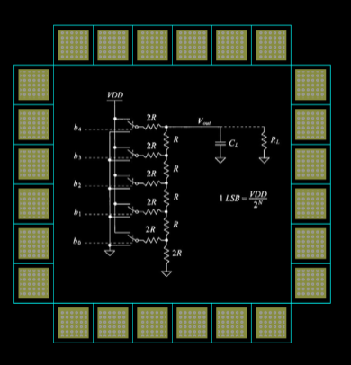
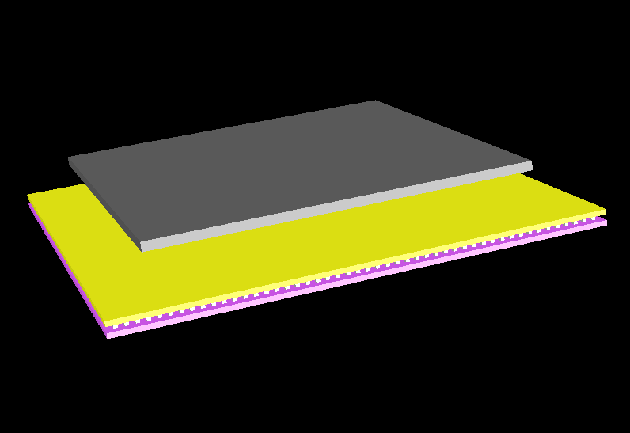
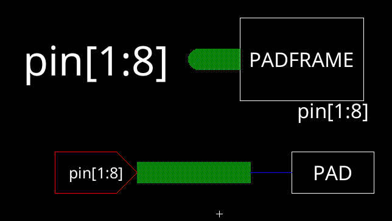
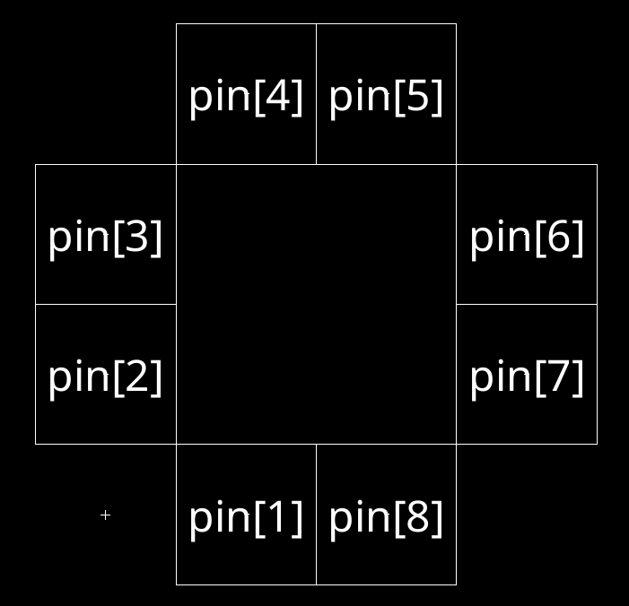
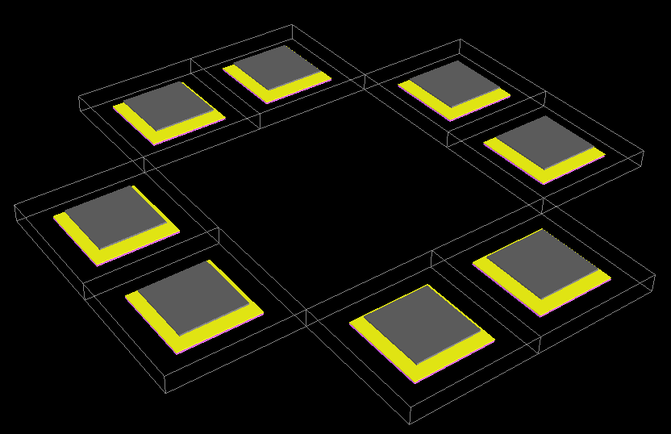
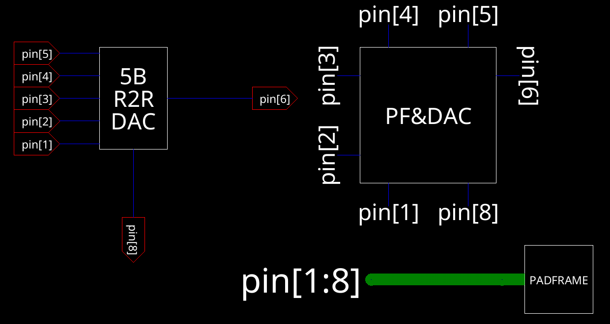
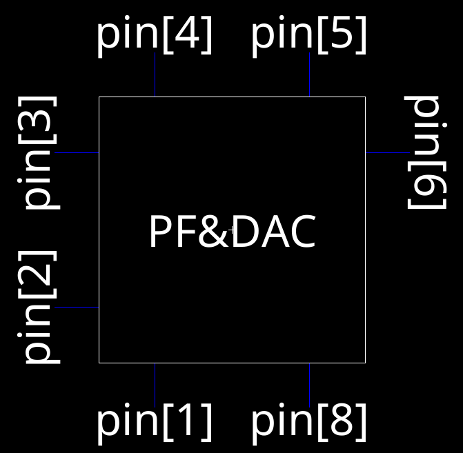
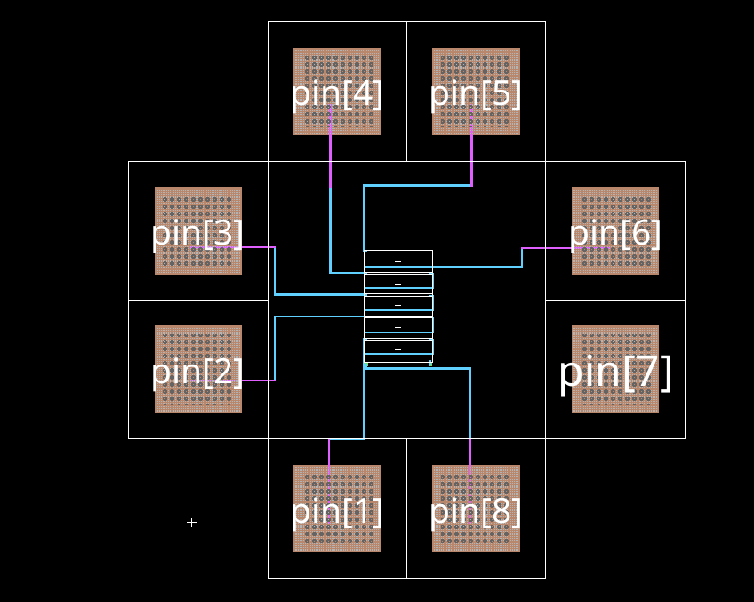
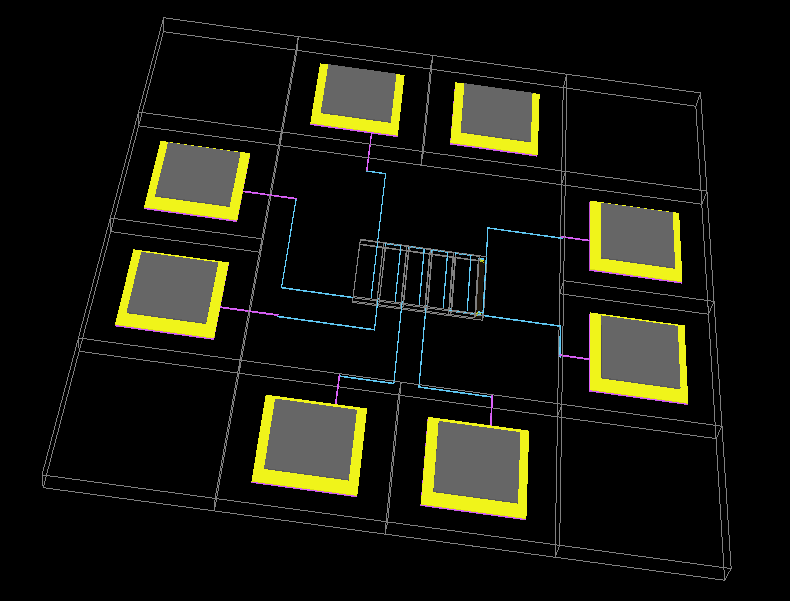

# Lab 2: Padframe with DAC

Cade Thornton

10/23/2023

ENCE 3501

## Table of Contents

-------

+ [Introduction](#Introduction )
+ [Pad Cell](#Link)
    * [Schematic](#Schematic)
    * [Layout](#Layout)
+ [PadFrame](#Link)
    * [Schematic](#Schematic)
    * [Layout](#Layout)
+ [PadFrameDAC](#Link)
    * [Schematic](#Schematic)
    * [Layout](#Layout)
+ [Conclusion](#Conclusion)

## Introduction 

 
The goal of this lab is to create a padframe that contains the 5-bit DAC made previously. The padframe will consist of various subcomponent libraries that will be made over the course of this lab.

  

  

    Figure 1 (Padframe with DAC)
  

## Pad Cell

### Schematic

 
A single pad cell schematic in electricVLSI is shown below. It consists of only a wire node intended to be used in the padframe

  

  

    Figure 2 (Pad Cell Schematic)
  

 
And here is the icon generated by the pad cell schematic

  

  

    Figure 3 (Generated Pad Cell Icon)
  

### Layout 

 
The padcell will have three layers as is dictated by the lab requirements: Metal one as the first layer, metal 2 as the second, and an overglass layer as the third.

  

  

    Figure 4 (Pad Cell Layout)
  

 
This is the 3D view of the layout. It clearly displays the three layers discussed previously

  

  

    Figure 5 (3D Pad Cell Layout View)
  

------

## Pad Frame

### Schematic 

 
After completing the pad cell, the padframe could be made quickly using the pad icon from before. The padframe is connected to an eight-pin bus of exports that are necessary due to the five outputs and inputs of the DAC.

  

  

    Figure 6 (Schematic of padframe)
  

 
And here is the generated icon:

  

  

    Figure 7 (Schematic of padframe icon)
  

### Layout

 
By using an array of 8x8 pads, the padframe layout can be constructured as shown below:

  

  

    Figure 8 (Layout of padframe)
  

 
And here is the corresponding 3D view of the padframe

  

  

    Figure 9 (3D view of Layout of the padframe)
  

-------

## Padframe DAC
### Schematic 

 
The schematic of the padframe with the DAC connected was made using an 8-pin bus with the padframe icon, and every pin of the padframe is connected to the DAC, as shown below:

  

  

    Figure 10(Schematic of padframe connected with the DAC)
  

 
And here is the corresponding icon generated:

  

  

    Figure 11( Icon generated from Schematic of padframe connected with the DAC)
  

### Layout 

 
The layout for the padframe with DAC connected was constructed by connecting every pin to metal 1 to metal 2 contacts.

  

  

    Figure 12( Layout padframe connected with the DAC)
  

 
And here is the corresponding 3D view

  

  

    Figure 13 (3D view of the Layout with padframe connected with the DAC)
  

## Conclusion

------

This lab concluded with the final IC being construced using various cell libraries such as the 5-Bit DAC, voltage divider, cell, padframe, and finally the combination of all of them. The lab demonstrated the process of using pads to allow the DAC to have external connections via the padframe.

