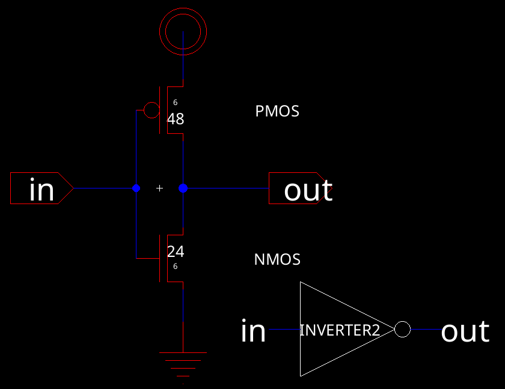

# Lab 4: Inverter

Cade Thornton

11/3/2023

ENCE 3501

## Table of Contents

-------

+ [Introduction](#Introduction )
+ [Inverter 1](#Inverter1)
    * [Schematic](#Schematic)
    * [Layout](#Layout)
    * [Simulations](#Simulations)
+ [Inverter 2](#Inverter2)
    * [Schematic](#Schematic)
    * [Layout](#Layout)
    * [Simulations](#Simulations)
+ [Conclusion](#Conclusion)

## Introduction 

The purpose of this lab is to utilize NMOS, PMOS, NWELL and PWELL standard library components to construct a CMOS inverter of various sizes.

  

  

    Figure 1 (CMOS Inverter Schematic)
  

## Inverter 1

### Schematic

Below is the electricVLSI schematic of the first inverter. It is necessary to make the PMOS transistor larger than the NMOS (PMOS is 12 by 6 while the NMOS is 6 by 6)

  

  

    Figure 2 (CMOS inverter 1 schematic)
  

And here is the generated icon from electricVLSI

  

  

    Figure 3 (CMOS inverter 1 schematic icon)
  

### Layout 

Below is the created layout, which has been constructed in accordance with the schematic, utilizing the NMOS and PMOS provided by the standard library. The PMOS is tied to an nWell that serves as vdd, while the NMOS links to a pWell that functions as the ground. The connection of the NMOS and PMOS follows the design outlined in the schematic.

  

  

    Figure 4 (CMOS inverter 1 layout)
  

Here is a 3D view of the layout which demonstrates the pWell and nWell connections

  

  

    Figure 5 (CMOS inverter 1 layout 3D view)
  

### Simulations 

The spice code applies 5V across the inverter for a duration of 1ms in the initial simulation of Inverter 1, which is aimed at evaluating the inverter's switching threshold. The optimal switching point for the inverter is expected to be at half of vdd.

  

  

    Figure 6 (CMOS inverter 1 simulation)
  

The waveform for the results of the simulation is shown below. The simulation results were deemed successful as the switching point occurred at ~ 2.4V, which is approximately half of vdd, given that vdd was 5V. 

  

  

    Figure 7 (CMOS inverter 1 simulation waveform. Inverter 2 is included because it is simulated in a similar manner)
  

In the second simulation of Inverter 1 (shown below), the spice code conducts an analysis of the inverter's transient response to a pulse wave applied to vin and 5V to vdd, with load capacitors valued at 100f, 1p, 10p, and 100p to observe how the inverter behaves under different capacitive loads.

  

  

    Figure 8 (CMOS inverter 1 simulation schematic for difference load capacitances)
  

And here is the resulting waveform, showing that the output of the inverter is affected heavily by the capacitors, distorting the waveform

  

  

    Figure 9 (CMOS inverter 1 simulation waveform for difference load capacitances, heavily distorted)
  

------

## Inverter 2

### Schematic 

 The second Inverter shares the same schematic design as Inverter 1, with the distinction lying in the dimensions of the CMOS components. The PMOS in Inverter 2 is designed with a drawn width of 48 and retains a length of 6, while the NMOS is characterized by a drawn width of 24, also maintaining a length of 6.

  

  

    Figure 10 (CMOS inverter 2 schematic)
  

 Here is the corresponding icon generated by electricVLSI:

  

  

    Figure 11 (CMOS inverter 2 schematic icon)
  

### Layout 

By cascading four layouts of Inverter 1, a larger inverter layout was produced, effectively increasing the inverter's size solely by expanding the width of the CMOS components:

  

  

    Figure 12 (CMOS inverter 2 layout)
  

And here is the corresponding 3D layout view:

  

  

    Figure 13 (CMOS inverter 2 layout in 3D)
  

### Simulations 

The second inverter was simulated in a similar manner to the first, with the same schematic applying (see figure 8) and a successful simulation value of Vout being approximatley half of vin

  

  

    Figure 14 (CMOS inverter 2 schemaic simulation)
  

We then tested different load capacitor values again on inverter 2, with the output being similarly distorted:

  

  

    Figure 15 (CMOS inverter 2 schemaic simulation with load capacitance)
  

-------

## Conclusion

Lab 4 delved into developing a logic gate through CMOS technology, crafting an inverter in different sizes and subjecting it to tests with various load capacitor values. These inverters are intended for incorporation into more intricate CMOS layouts in upcoming projects.

