# Lab #5: Full Adder

Cade Thornton

11/3/2023

ENCE 3501

## Table of Contents

-------

+ [Introduction](#Introduction )
+ [NAND](#NAND)
    * [Schematic](#Schematic)
    * [Layout](#Layout)
    * [Simulations](#Simulations)
+ [NOT](#NOT)
    * [Schematic](#Schematic)
    * [Layout](#Layout)
    * [Simulations](#Simulations)
+ [XOR](#XOR)
    * [Schematic](#Schematic)
    * [Layout](#Layout)
    * [Simulations](#Simulations)
+ [Full Adder](#FullAdder)
    * [Schematic](#Schematic)
    * [Layout](#Layout)
    * [Simulations](#Simulations)
+ [Conclusion](#Conclusion)

## Introduction 

-------

<p align="center">
The purpose of this lab is to utilize NMOS, PMOS, NWELL and PWELL standard library components to construct a CMOS inverter of various sizes.
<p>

<p align="center">
  
</p>

<div align="center">
  <p style="font-size: small;">
    Figure 1 (Schematic of the Full Adder)
  </p>
</div>


## NAND

### Schematic

<p align="center">
The schematic for the NAND gate is shown below. It is fairly simple with two NMOS transistors and a pull-down network"
<p>

<p align="center">
  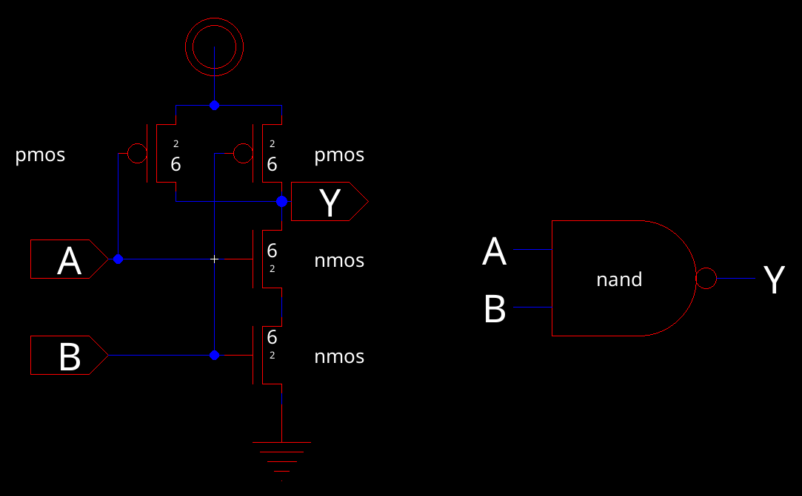
</p>

<div align="center">
  <p style="font-size: small;">
    Figure 2 (Schematic of the NAND gate)
  </p>
</div>

<p align="center">
And this is the corresponding icon generated from electricVLSI, with some custom art styles
<p>

<p align="center">
  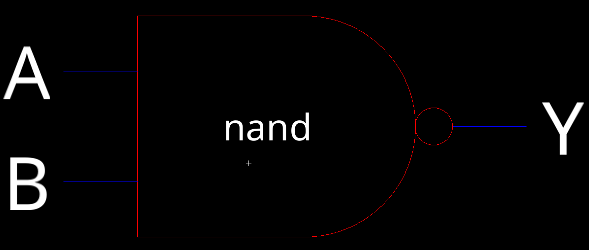
</p>

<div align="center">
  <p style="font-size: small;">
    Figure 3 (Schematic icon of the NAND gate)
  </p>
</div>


### Layout 

<p align="center">
Utilizing NMOS and PMOS from the standard library, the layout has been constructed. The PMOS links to an nWell, designated as vdd, while the NMOS connects to a pWell, identified as ground. As per the schematic, the NMOS and PMOS have been interconnected. Figure 5 displays a screenshot of this layout.
<p>

<p align="center">
  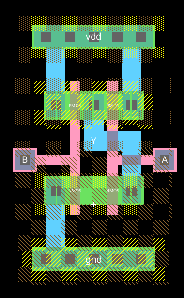
</p>

<div align="center">
  <p style="font-size: small;">
    Figure 4 (Layoutof the NAND gate)
  </p>
</div>

<p align="center">
And here is the corresponding 3D layout of the NAND gate
<p>

<p align="center">
  
</p>

<div align="center">
  <p style="font-size: small;">
    Figure 5 (Layoutof the NAND gate)
  </p>
</div>

<p align="center">
And here is the corresponding 3D layout of the NAND gate
<p>

<p align="center">
  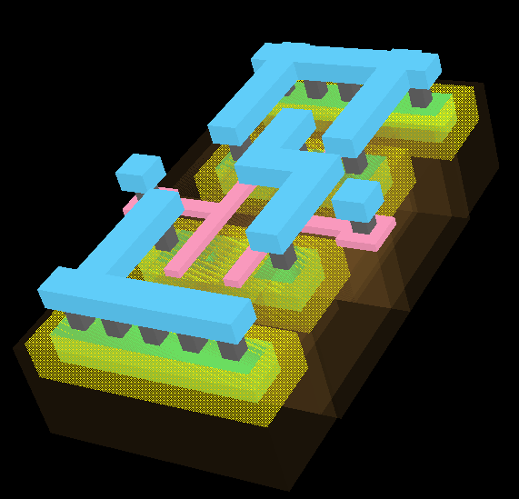
</p>

<div align="center">
  <p style="font-size: small;">
    Figure 6 (3D Layoutof the NAND gate)
  </p>
</div>


### Simulations 

<p align="center">
The initial simulation evaluates the NAND gate's switching point. Ideally, this point for an inverter lies at half of vdd. In the simulation, the SPICE code applies a constant 5V to one input and a pulse wave ranging from 0V to 5V to another. The resulting transient response is subsequently recorded.
<p>

<p align="center">
  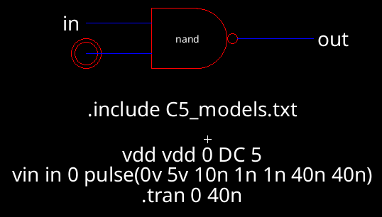
</p>

<div align="center">
  <p style="font-size: small;">
    Figure 7 (NAND gate schematic simulation)
  </p>
</div>

<p align="center">
  The spice code for the schematic is given below:
</p>

```
vdd vdd 0 DC 5
vin in 0 pulse(0v 5v 10n 1n 1n 40n 40n)
.tran 0 40n
```

<div align="center">
  <p style="font-size: small;">
    Figure 8 (NAND gate schematic simulation SPICE code)
  </p>
</div>

<p align="center">
  The resulting waveform is shown below. Vin is half of Vout, indicating a correct switching point was achieved.
</p>

<p align="center">
  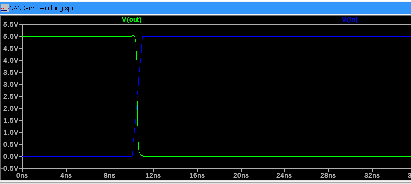
</p>

<div align="center">
  <p style="font-size: small;">
    Figure 9 (NAND gate schematic simulation)
  </p>
</div>

<p align="center">
  For the NAND gate's second simulation, which assesses the behavior of the logic values, the SPICE code administers 5V to vdd. It introduces a pulse wave to both inputs, timing these waves with an offset. This approach allows for observing the relationship between various input combinations and the output. Following this, the transient response is documented.
</p>

<p align="center">
  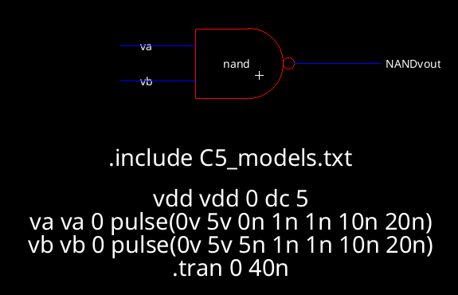
</p>

<div align="center">
  <p style="font-size: small;">
    Figure 10 (NAND gate schematic logic simulation)
  </p>
</div>

<p align="center">
  The resulting waveform demonstrating the correct operation of the NAND gate is shown below
</p>

<p align="center">
  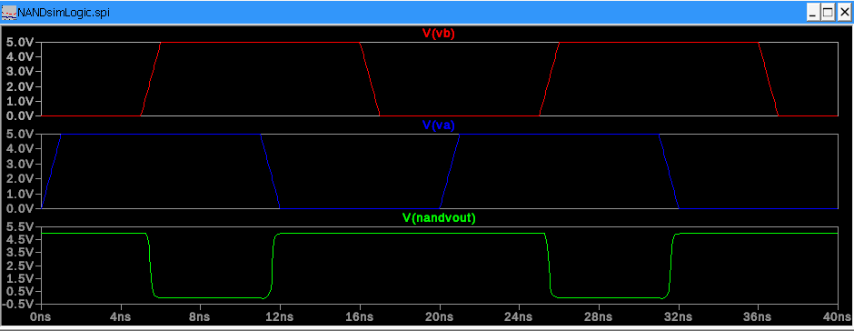
</p>

<div align="center">
  <p style="font-size: small;">
    Figure 11 (NAND gate schematic logic simulation waveform)
  </p>
</div>

------

## NOT

### Schematic 

<p align="center">
 The NOT gate was designed in a similar manner to the NAND gate, but with only a single NMOS and PMOS transistor
</p>

<p align="center">
  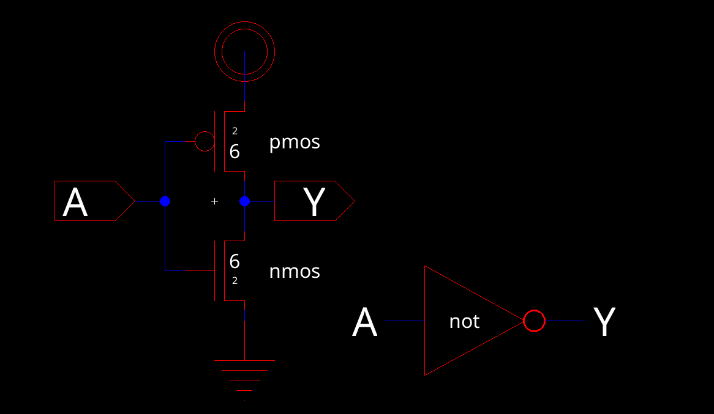
</p>

<div align="center">
  <p style="font-size: small;">
    Figure 12 (inverter gate schematic)
  </p>
</div>

<p align="center">
 And here is the generated icon from the schematic
</p>

<p align="center">
  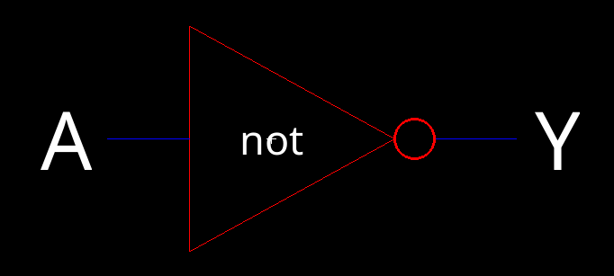
</p>

<div align="center">
  <p style="font-size: small;">
    Figure 13 (Inverter gate schematic icon)
  </p>
</div>


### Layout 

<p align="center">
 Using NMOS and PMOS components from the standard library, the layout was developed. The PMOS connects to an nWell, which is outputted as vdd, while the NMOS links to a pWell, designated as ground. These NMOS and PMOS elements are interconnected following the schematic's guidelines. 
</p>

<p align="center">
  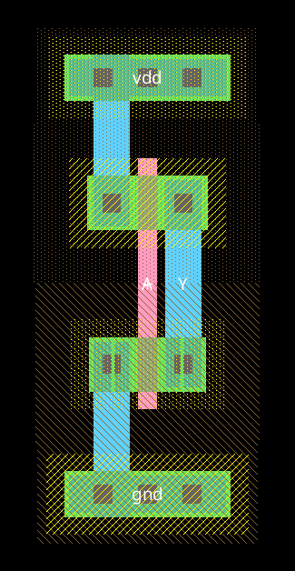
</p>

<div align="center">
  <p style="font-size: small;">
    Figure 14 (Inverter gate layout)
  </p>
</div>

<p align="center">
 And here is a 3D view of the layout:
</p>

<p align="center">
  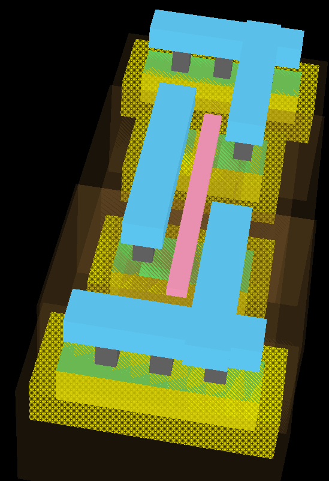
</p>

<div align="center">
  <p style="font-size: small;">
    Figure 15 (Inverter gate layout in 3D)
  </p>
</div>

### Simulations 

<p align="center">
 The inverter was simulated in a similar manner to the NAND gate, but only a switching point simulation was done for obvious reasons 
</p>

<p align="center">
  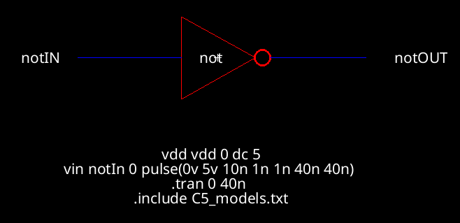
</p>

<div align="center">
  <p style="font-size: small;">
    Figure 16 (Inverter schematic simulation)
  </p>
</div>

<p align="center">
 And here is the outputted waveform, with a clear indication of half of Vin being outputted to Vout
</p>

<p align="center">
  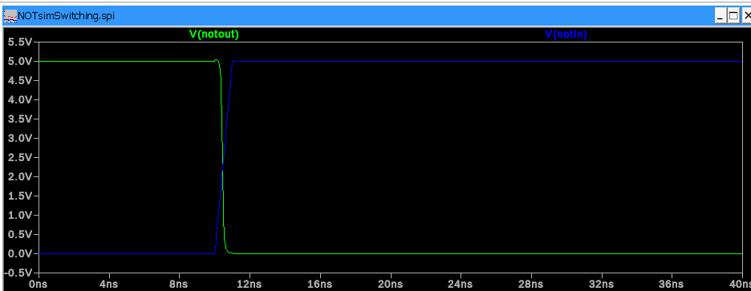
</p>

<div align="center">
  <p style="font-size: small;">
    Figure 18 (Inverter schematic simulation wavform)
  </p>
</div>


-------

## XOR

### Schematic

<p align="center">
 The XOR gate schematic is again similar to the other two gates, but requried significantly more transistors to represent the additional values in its truth table
</p>

<p align="center">
  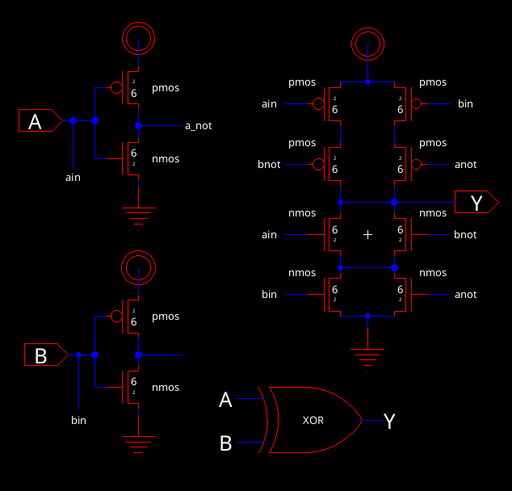
</p>

<div align="center">
  <p style="font-size: small;">
    Figure 19 (XOR schematic)
  </p>
</div>

<p align="center">
 And here is the corresponding icon generated:
</p>

<p align="center">
  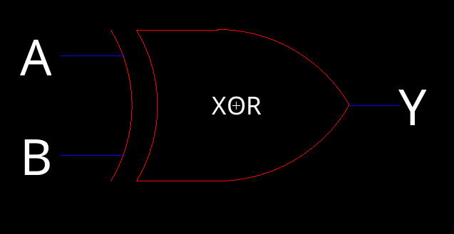
</p>

<div align="center">
  <p style="font-size: small;">
    Figure 20 (XOR schematic icon)
  </p>
</div>

### Layout 

<p align="center">
 The layout has been formulated using NMOS and PMOS transistors from the standard library. PMOS transistors are linked to an nWell, which is then exported as vdd, whereas the NMOS transistors are connected to a pWell that is designated as ground. Following the schematic's design, these NMOS and PMOS transistors are interconnected.
</p>

<p align="center">
  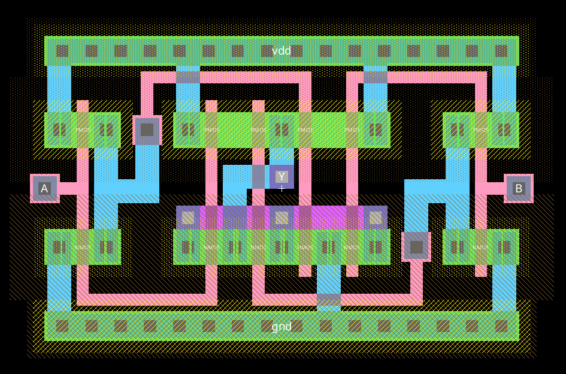
</p>

<div align="center">
  <p style="font-size: small;">
    Figure 21 (XOR layout)
  </p>
</div>

<p align="center">
 And here is the corresponding 3D view:
</p>

<p align="center">
  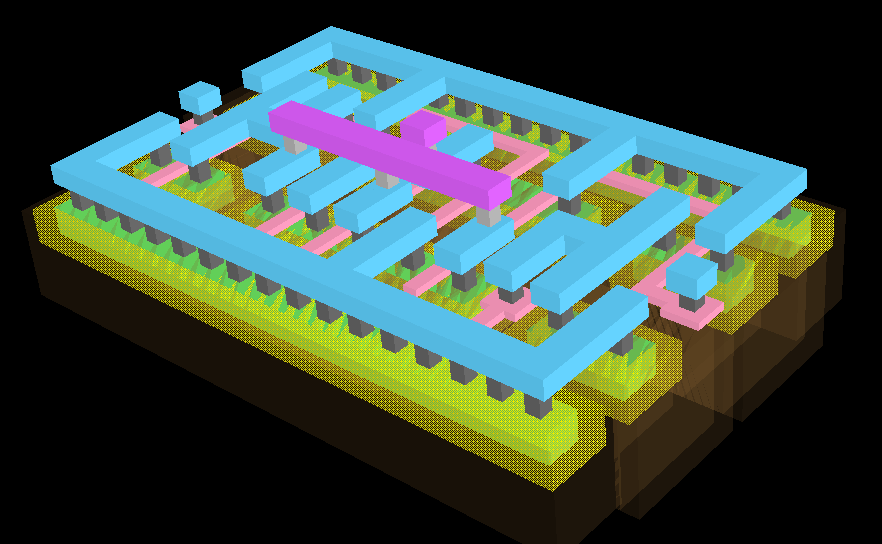
</p>

<div align="center">
  <p style="font-size: small;">
    Figure 22 (XOR layout in 3D)
  </p>
</div>


### Simulations 

<p align="center">
 The XOR gate is again simulated to test its switching point and its internal logic. The former is shown below
</p>

<p align="center">
  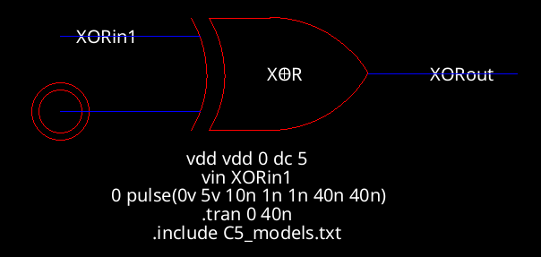
</p>

<div align="center">
  <p style="font-size: small;">
    Figure 23 (XOR switching simulation schematic)
  </p>
</div>

<p align="center">
 And here is the output waveform that demonstrates the correct switching point in the same manner as the previous simulations
</p>

<p align="center">
  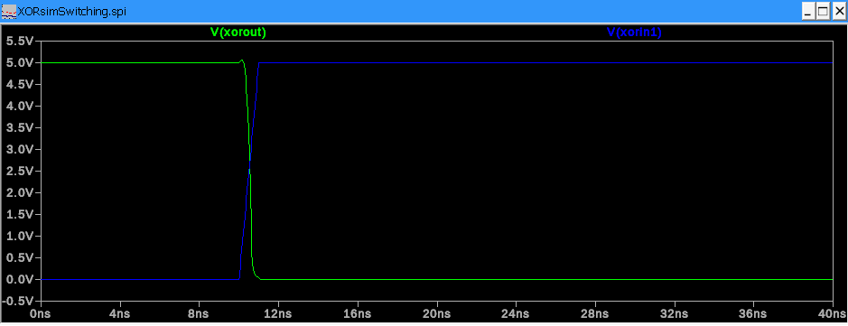
</p>

<div align="center">
  <p style="font-size: small;">
    Figure 23 (XOR switching simulation output waveform)
  </p>
</div>

<p align="center">
 The logic simulation was performed next, and here is the corresponding schematic
</p>

<p align="center">
  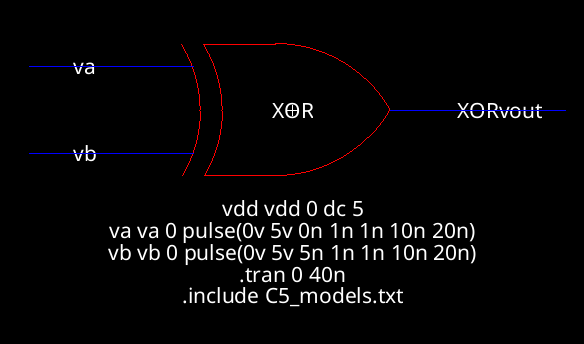
</p>

<div align="center">
  <p style="font-size: small;">
    Figure 24 (XOR logic simulation schematic)
  </p>
</div>

<p align="center">
 The corresponding waveform demonstrating the correct logic values is shown below
</p>

<p align="center">
  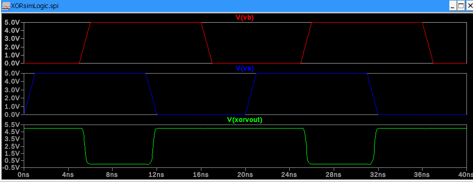
</p>

<div align="center">
  <p style="font-size: small;">
    Figure 25 (XOR logic simulation waveform)
  </p>
</div>

<p align="center">
  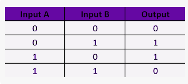
</p>

<div align="center">
  <p style="font-size: small;">
    Figure 26 (XOR logic truth table for reference)
  </p>
</div>


------

## Full-Adder

### Schematic 

<p align="center">
 The schematic provided incorporates three NAND gates and two XOR gates. To replicate the accurate functioning of a full adder, this schematic was developed by utilizing the previously designed NAND and XOR gate schematics.
</p>

<p align="center">
  
</p>

<div align="center">
  <p style="font-size: small;">
    Figure 27 (Full Adder Schematic)
  </p>
</div>

<p align="center">
 And here is the corresponding schematic icon generated
</p>

<p align="center">
  
</p>

<div align="center">
  <p style="font-size: small;">
    Figure 28 (Full Adder Schematic Icon)
  </p>
</div>


### Layout 

<p align="center">
 The layout for the full-adder was constructed by combining the previously made layouts onto a single layout
</p>

<p align="center">
  
</p>

<div align="center">
  <p style="font-size: small;">
    Figure 29 (Full Adder layout)
  </p>
</div>

<p align="center">
 And here is a 3D view of the layout:
</p>

<p align="center">
  
</p>

<div align="center">
  <p style="font-size: small;">
    Figure 30 (Full Adder layout in 3D)
  </p>
</div>

### Simulations 

<p align="center">
 The full-adder was simulated in a similar manner to the logic gates, with a logic simulation for both the schematic and the layout. In the Full Adder's initial simulation, the focus is on testing the logic values as per the schematic. The SPICE code channels a 5V pulse wave through each input. Specifically, the pulse wave on input B carries a 5ns offset, and the pulse wave on Cin bears a 2ns offset. This setup facilitates the recording of the transient response. It enables monitoring of the output in relation to different combinations of inputs.
</p>

<p align="center">
  
</p>

<div align="center">
  <p style="font-size: small;">
    Figure 31 (Full Adder schematic simulation)
  </p>
</div>

<p align="center">
 And here is the schematic simulation output waveform demonstrating the correct functionality of the full adder
</p>

<p align="center">
  
</p>

<div align="center">
  <p style="font-size: small;">
    Figure 32 (Full Adder schematic simulation waveform)
  </p>
</div>

<p align="center">
 Next up is the simulation of the layout, which is shown below:
</p>

<p align="center">
  
</p>

<div align="center">
  <p style="font-size: small;">
    Figure 33 (Full Adder layout simulation)
  </p>
</div>

<p align="center">
 And finally the waveform demonstrating the correct functionality
</p>

<p align="center">
  
</p>

<div align="center">
  <p style="font-size: small;">
    Figure 34 (Full Adder layout simulation Waveform)
  </p>
</div>


-------

## Conclusion

Lab 5 delved into constructing a more intricate CMOS circuit, specifically a Full Adder. This Full Adder was assembled using several sub-components, each developed as part of the lab. The process of building the Full Adder offers valuable insights into the intricacies of designing complex CMOS circuits within the realm of VLSI.

------


